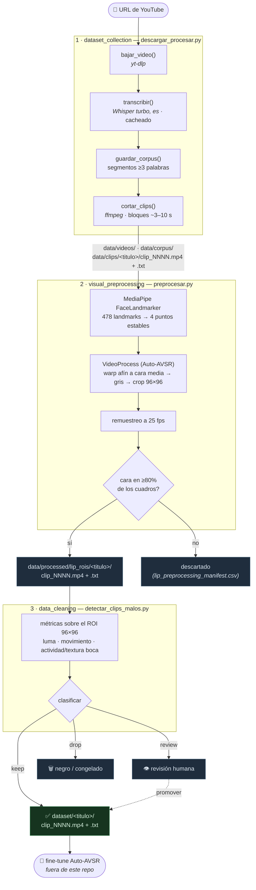

# Flujo del repositorio

De un link de YouTube a un dataset curado de clips labiales 96×96 listos para
fine-tunear Auto-AVSR. Tres etapas, cada una con su carpeta/módulo, sus herramientas y
sus artefactos de salida.



## Paso a paso

### Etapa 1 — Recolección (`descargar_procesar.py`)

Entrada: una URL de YouTube. Un único comando:

```bash
python descargar_procesar.py "URL_DE_YOUTUBE"
```

1. **`bajar_video(url)`** — `yt-dlp` obtiene el título y descarga el `.mp4`
   → `data/videos/<titulo>/`.
2. **`transcribir(...)`** — Whisper (`turbo`, `language="es"`) transcribe. Se cachea en
   `data/corpus/<titulo>/transcripcion.json`; si existe, se reutiliza.
3. **`guardar_corpus(...)`** — vuelca el texto limpio (segmentos ≥3 palabras) a
   `data/corpus/<titulo>/corpus.txt`. `limpiar()` baja a minúsculas, saca puntuación y
   translitera acentos preservando la **ñ**.
4. **`cortar_clips(...)`** — agrupa segmentos en bloques de ~3–10 s y con `ffmpeg`
   genera pares `data/clips/<titulo>/clip_NNNN.mp4` + `clip_NNNN.txt` (cada `.txt` es la
   transcripción exacta de su clip). **La alineación video↔texto es lo crítico acá.**

### Etapa 2 — Preprocesamiento visual (`visual_preprocessing/src/preprocesar.py`)

Toma los clips alineados y produce los recortes labiales que espera Auto-AVSR.

```bash
python -m visual_preprocessing.src.preprocesar            # todas las fuentes
python -m visual_preprocessing.src.preprocesar "<titulo>" # una fuente
```

1. **MediaPipe FaceLandmarker** detecta 478 landmarks por cuadro → se extraen 4 puntos
   estables (ojo der., ojo izq., nariz, centro de boca).
2. **`VideoProcess`** (adaptado de Auto-AVSR) estima una **transformación afín** que
   alinea esos 4 puntos a una **cara media** de referencia, pasa a gris y recorta
   **96×96** centrado en la boca.
3. Remuestreo a **25 fps**.
4. Si la cara aparece en **<80%** de los cuadros, el clip se **descarta**.

Salida: `data/processed/lip_rois/<titulo>/clip_NNNN.mp4` + `.txt` y el manifest
`data/metadata/lip_preprocessing_manifest.csv` (incluye los descartados).

> Normalización (`/255`, `Normalize(0.421, 0.165)`) y `CenterCrop(88)` **no** se hacen
> acá: las aplica el loader de entrenamiento de Auto-AVSR.

### Etapa 3 — Curación (`data_cleaning/src/detectar_clips_malos.py`)

Audita los ROIs 96×96 (lo que ve el modelo) y arma el dataset final. No usa MediaPipe.

```bash
python -m data_cleaning.src.detectar_clips_malos               # audita -> manifest
python -m data_cleaning.src.detectar_clips_malos --materializar # copia keep -> dataset/
```

Calcula por clip: `luma_media`, `frac_oscuros`, `movimiento_global`, `actividad_boca`,
`textura_boca`, y clasifica:

| Estado | Criterio | Destino |
|---|---|---|
| **drop** | negro (luma baja) **o** congelado (sin movimiento) | se descarta |
| **review** | boca de baja actividad+textura con texto (posible oclusión/desenfoque) | revisión humana |
| **keep** | el resto | `dataset/` |

Salida: `data/metadata/auditoria_clips_manifest.csv` (keep/review/drop + métricas) y, al
materializar, el **dataset final curado** en `dataset/<titulo>/` + `dataset/manifest.csv`.

### Etapa 4 — Modelado (fuera de este repo)

`dataset/` es el insumo rioplatense para fine-tunear Auto-AVSR (junto con LIP-RTVE),
destilar al student causal y sumar el corrector LLM. Ver el paper en `../survey-nlp`.

## Mapa de artefactos

```text
data/
  videos/<titulo>/                 # .mp4 crudo (regenerable, gitignored)
  corpus/<titulo>/                 # transcripcion.json + corpus.txt
  clips/<titulo>/                  # clips crudos alineados (mp4 + txt)
  processed/lip_rois/<titulo>/     # ROIs labiales 96×96 (salida etapa 2)
  metadata/
    fuentes.csv
    lip_preprocessing_manifest.csv # estado del preproc visual por clip
    auditoria_clips_manifest.csv   # keep/review/drop del detector
dataset/<titulo>/                  # ✅ dataset FINAL curado (solo keep) + manifest.csv
```
