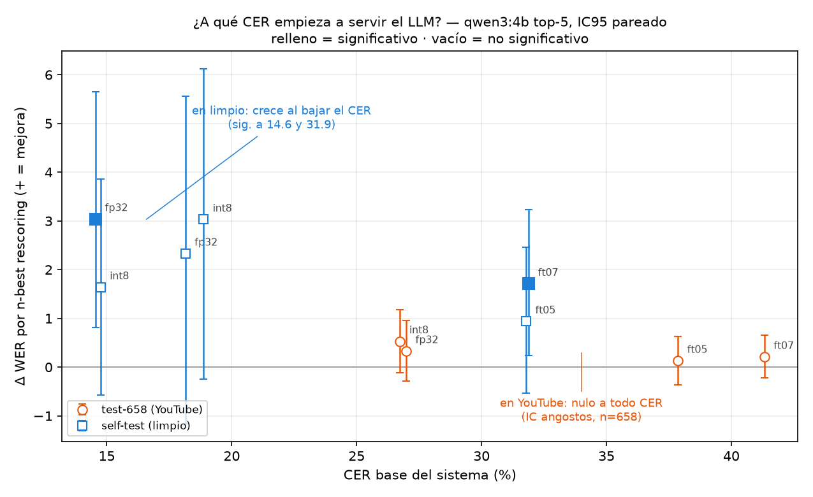

# 04 — Corrector / rescoring con LLM (qwen)

**Hipótesis del usuario:** un modelo con **CER bajo** se corrige mejor con un LLM que uno con WER bajo
(los errores serían "typos" arreglables). Se probó exhaustivamente.

**Setup:** corrector = `qwen3:4b-instruct-2507-q4_K_M` (Ollama local, `think=false`, temp 0). Ojo: la
variante base "thinking" NO sirve (razona en el output y rompe todo). También disponible `qwen3.5:9b`.
Scripts: `llm_corrector/fase0_llm_correct.py`, y en scratchpad `qwen_lab.py`, `nbest_ft05.py`,
`visper_full_test.py`. Métrica: misma `norm()` + WER/CER, IC bootstrap. El experimento definitivo
(grilla de 13 celdas, resultado que cierra la pregunta) está en **§G**; su código y datos crudos en
[`llm_corrector/grid_cer_llm/`](../../llm_corrector/grid_cer_llm/).

---

## A. Corrección 1-best (Fase 0) — sobre 658 clips

| Modelo | CER base | %WER base→corr | %CER base→corr |
|---|---|---|---|
| ft05b | 42 | 70.30 → 71.04 (**+0.74 ❌**) | 42.07 → 43.77 (+1.70 ❌) |
| ft07 | 42 | 69.15 → 70.11 (**+0.96 ❌**) | 41.65 → 43.26 (+1.61 ❌) |
| **ViSpeR zero-shot** | 27 | 45.22 → 46.64 (**+1.42 ❌**) | 26.98 → 28.32 (+1.35 ❌) |

Estratificado por CER-por-clip: **empeora en TODOS los estratos**, y en ViSpeR el bucket más limpio
(CER 0-20) es el que MÁS empeora (+2.26). Motivo: los errores de lip-reading son **sustituciones por
otra palabra válida** (viseme-confusion), no typos → el LLM ciego al video lee español fluido, no tiene
señal de que está mal, y sobre-corrige lo que estaba bien.

**Conclusión A:** la corrección 1-best naive NO ayuda a CER 42 ni 27.

---

## B. Comparación de prompts — ft05b, 24 clips (base WER 69.13)

| Prompt | Δ WER | Δ CER | comportamiento |
|---|---|---|---|
| conservative | +0.26 | +0.83 | corrige de más |
| minimal | +0.00 | +0.67 | el más seguro, no mejora |
| fluent | +0.26 | +1.76 | **inventa** frases nuevas |

**Conclusión B:** ningún prompt rescata la corrección 1-best; "fluent" es el peor (alucina).

## C. qwen sobre el texto REAL (test de corrupción) — ft05b, 24 clips

Alimentar al LLM el texto CORRECTO (ground-truth): corrompe **2.04% WER / 0.93% CER** de texto ya perfecto
(ej: "me diga"→"me dijera"). → El corrector tiene un **piso de daño** aunque le des la verdad.

## D. Few-shot supervisado — ft05b, 24 clips, 5 demos hyp→ref (corrección ideal)

WER 69.13 → 68.88 (**−0.26**), CER +0.31. Nivel-ruido. Ni con demos de corrección ideal mejora.

---

## E. n-best rescoring — ft05 (50M), 40 clips (test-658)

En vez de corregir 1 hipótesis, darle al LLM las **top-N del beam** para que elija/combine.

| Enfoque | %WER |
|---|---|
| 1-best | 62.79 |
| **oracle-5** (mejor de 5, techo tramposo) | 55.04 |
| qwen n-best rescored | 62.64 (**−0.16**, no mejora) |

Las 5 candidatas del beam son **variaciones del mismo error** (la palabra correcta no está en ninguna)
→ ni el oracle baja de 55, y qwen no supera al 1-best. **A CER 42, el n-best tampoco alcanza.**

---

## F. ⭐ n-best rescoring — ViSpeR sobre self-test LIMPIO, 40 clips (CER ~11)

Acá el modelo base es bueno (CER 11) → el beam SÍ contiene la palabra correcta en candidatas bajas.

| Enfoque | %WER | %CER |
|---|---|---|
| 1-best (base) | 23.60 ± 6.6 | 11.41 ± 3.5 |
| qwen **1-best corregido** | 25.00 (**+1.40 ❌**) | 12.98 (+1.6 ❌) |
| **qwen n-best rescoring** | **20.22 (−3.37 ✅)** | **9.89 (−1.52 ✅)** |
| oracle-5 (techo) | 16.57 (−7.0) | 8.32 |

Ejemplos donde el n-best recupera lo correcto: "un hasta dos domingos"→"un asado el domingo";
"autocusado"→"auto usado"; "no te nos ganas"→"no tengo ganas".

### F2. ⭐⭐ Confirmación a n=100 (self-test ampliado) — AHORA SIGNIFICATIVO

Ampliamos el self-test a 100 clips (los 60 nuevos son más difíciles → WER base sube a 29.5, ver [05](05_selftest_limpio.md)).
Con **bootstrap PAREADO** del delta 1-best vs rescored:

| fp32 beam40 (n=100) | %WER | IC |
|---|---|---|
| 1-best | 29.51 | ±4.4 |
| **qwen n-best rescoring** | **26.46** | ±4.5 |
| oracle-5 (techo) | 21.66 | |
| **delta (1best−rescored)** | **−3.04** | **IC95 pareado [+0.71, +5.53] → excluye 0 ✅ SIGNIFICATIVO** |

El efecto (~3 WER) se mantuvo de n=40 (−3.4) a n=100 (−3.04) y **el IC pareado ya excluye el 0**. → **El n-best
rescoring baja el WER de verdad, no es ruido.** (Test int8: qwen le ayuda menos, −1.6 y cruza 0; el LLM no
recupera la degradación de int8. Ver [09](09_velocidad_inferencia.md) §G.)

---

## G. ⭐⭐⭐ Grilla estandarizada del umbral CER/LLM (2026-07-10)

Los §A–F2 exploraron el efecto de a poco (12→40→100 clips, celdas sueltas). §G lo cierra con **un
solo protocolo** sobre una grilla de **13 celdas** que barre el CER de punta a punta y separa el eje
de **dominio**, con estadística pareada. Scripts, datos crudos y figura:
[`llm_corrector/grid_cer_llm/`](../../llm_corrector/grid_cer_llm/) (datos en `data/`,
tabla máquina en `data/grid_puntos.json`).

**Diseño.** Eje CER = 4 sistemas (ft07/ft05 de 50M; ViSpeR 288M en int8 y fp32) → CER base 14.6–41.3.
Dos dominios: `test-658` (YouTube rioplatense, 2 hablantes held-out, refs de Whisper) y `selftest-150`
(frases leídas a cámara: 100 de Fede + 50 de un 2º hablante con frases nuevas, refs exactas). Mismo LLM
en todo (qwen3:4b-instruct q4_K_M, Ollama, temp 0, sin thinking): **corrección 1-best** y **n-best
rescoring** (top-5), con techo **oracle-5**. **IC95 con bootstrap pareado** (5000 remuestreos) del delta
por clip; la curva del umbral se traza *dentro* de cada test set (mismas frases, distinto modelo → el
confound de frases queda controlado).

| celda | n | CER₀ | WER₀ | corr-1best | resc | oracle-5 | Δresc (IC95) | Δcorr |
|---|---|---|---|---|---|---|---|---|
| ft07 × 658 | 658 | 41.32 | 69.04 | 69.86 | 68.83 | 64.96 | +0.21 [−0.22,+0.65] ≈ | −0.82 ❌sig |
| ft05 × 658 | 658 | 37.86 | 64.62 | 65.67 | 64.49 | 60.41 | +0.13 [−0.37,+0.63] ≈ | −1.05 ❌sig |
| ft07 × selftest | 150 | 31.89 | 62.90 | 63.76 | 61.18 | 56.43 | **+1.71 [+0.24,+3.23] ✅** | −0.86 ≈ |
| ft05 × selftest | 150 | 31.78 | 61.03 | 61.73 | 60.09 | 54.95 | +0.94 [−0.54,+2.46] ≈ | −0.70 ≈ |
| ViSpeR fp32 × 658 | 658 | 26.98 | 45.22 | 46.64 | 44.89 | 38.94 | +0.33 [−0.29,+0.96] ≈ | −1.42 ❌sig |
| ViSpeR int8 × 658 | 658 | 26.74 | 45.12 | 46.51 | 44.59 | 38.98 | +0.53 [−0.12,+1.18] ≈ | −1.39 ❌sig |
| ViSpeR int8 × amigo | 50 | 18.87 | 35.43 | 36.36 | 32.40 | 24.01 | +3.03 [−0.24,+6.12] ≈ | −0.93 ≈ |
| ViSpeR fp32 × amigo | 50 | 18.14 | 34.73 | 36.60 | 32.40 | 24.71 | +2.33 [−1.16,+5.56] ≈ | −1.86 ❌sig |
| ViSpeR int8 × fede | 100 | 14.75 | 29.98 | 35.48 | 28.34 | 22.01 | +1.64 [−0.57,+3.86] ≈ | −5.50 ❌sig |
| ViSpeR fp32 × fede | 100 | 14.55 | 29.51 | 35.13 | 26.46 | 21.66 | **+3.04 [+0.81,+5.65] ✅** | −5.62 ❌sig |
| *(control con-LM)* ft05 × fede | 100 | 30.76 | 55.74 | 59.84 | 57.26 | 48.13 | −1.52 [−4.29,+1.18] ≈ | −4.10 ❌sig |
| *(control con-LM)* ft05 × amigo | 50 | 37.38 | 63.40 | 64.34 | 65.03 | 57.58 | −1.63 [−5.32,+1.43] ≈ | −0.93 ≈ |
| *(control con-LM)* ft07 × amigo | 50 | 39.44 | 62.00 | 65.73 | 65.03 | 57.34 | **−3.03 [−5.54,−0.68] ❌sig** | −3.73 ❌sig |

(Δresc/Δcorr = mejora en WER; `+` = baja el WER = ayuda; `✅` significativo favorable, `❌sig`
significativo dañino, `≈` no significativo.)

**Hallazgos.**

1. **La corrección 1-best no ayuda NUNCA: 0/13 celdas** (8 dañinas con significancia), en CER 14–41,
   ambos dominios, ambos decoders. Confirma §A–D con muestra grande y el mecanismo del §C (el
   corrector daña incluso el texto correcto, +2.04 WER).
2. **En YouTube el rescoring es nulo a TODO CER (27–41), con precisión** (IC ±0.5 a n=658): ausencia de
   efecto, no falta de potencia.
3. **En material limpio el rescoring funciona y crece al bajar el CER**: +1.71 ✅ a CER 32, ~+2.5 a
   CER 18, +3.04 ✅ a CER 14.6. → **El umbral es condicional al dominio.** "CER bajo" es proxy de lo que
   importa: que la palabra correcta esté en el beam (en limpio pasa; en YouTube casi no, por ruido
   visual + refs de Whisper imperfectas).
4. **Replicación clave**: el efecto en limpio replica en un 2º hablante independiente con frases nuevas
   (−2.33 a n=50, misma dirección); **pool de 150 es significativo: −2.81 WER, IC95 [+0.86, +4.77]**.
   (Refina el −3.04 de §F2, que era solo el hablante 1.)
5. **Con LM externo en el beam el rescoring deja de servir e incluso daña** (−3.03 ❌ en una celda).
   No es falta de diversidad (las candidatas con-LM son *más* diversas: 0.25–0.30 vs 0.17–0.22).
   Hipótesis en pie: el LM ya volvió fluidas las candidatas erradas → el rescorer pierde su señal.
   Abierta.
6. **int8 ≈ fp32 en toda la grilla** — cuantizar no cambia la historia del LLM.
7. **Brecha al oracle**: el rescoring captura ~40 % del techo en la mejor celda (3.04 de 7.85).
   Cerrarla requeriría un rescorer entrenado (pulidos top-10/scores/9b no ayudaron — §F2/[09](09_velocidad_inferencia.md) §G).

**Limitaciones honestas.** El dominio limpio tiene 2 hablantes (150 clips): el efecto individual del 2º
no alcanza significancia solo (n=50), sí el pool y sí la dirección. Refs del test-658 por Whisper (techo
contaminado en YouTube). Las celdas con-LM usan otro decoder (espnet1 + LM CMU-MOSEAS) — control, no
comparación 1:1. Un solo LLM y un prompt por técnica (variantes ya exploradas en §B). Estratificar por el
CER del 1-best induce regresión a la media: leer los estratos como descriptivo.

---

## Conclusión general (hipótesis del CER)

- **La corrección 1-best NO ayuda a NINGÚN CER** probado (42, 27, 11) — sobre-corrige (over-correction).
- **El n-best rescoring SÍ ayuda cuando el CER es bajo (~11):** −3.4 WER / −1.5 CER. A CER alto (42) no,
  porque el beam no contiene la respuesta.
- **Tu hipótesis se confirma en dirección**, pero la llave es **n-best rescoring, no corrección 1-best**:
  el n-best le da *señal* (varias candidatas) que la corrección de una sola no tiene.
- **Cruce de signo del Δ WER:** CER 42 (+0.7) → 27 (+1.4) → 11 (−3.4 vía n-best). El umbral útil ≈ CER 20.
- ✅ **Significativo a n=100** (§F2): delta −3.04, IC95 pareado [+0.71, +5.53] excluye 0. (A n=40 era prometedor
  pero no concluyente; los 100 clips lo confirmaron.)
- Ojo: con 12 clips la corrección 1-best había dado −1.7 (falso positivo por ruido); el set de 40 lo corrigió.
- **La grilla estandarizada (§G, 13 celdas) cierra la pregunta:** el umbral no es solo de CER, es **condicional
  al dominio**. En limpio el rescoring crece al bajar el CER (+1.71 a CER 32 → +3.04 a CER 14.6, ambos ✅) y
  replica en un 2º hablante (pool n=150 = **−2.81 WER, IC95 [+0.86, +4.77]**, refina el −3.04 de §F2). En
  YouTube es nulo con precisión a todo CER (27–41). La corrección 1-best sigue en 0/13 celdas.

**Pulido probado (n=100, ver [09](09_velocidad_inferencia.md) §G):** top-10 no suma (26.35≈26.46), scores en
el prompt no ayudan (26.81), y **qwen3.5:9b es PEOR y 3.4× más lento** (27.52, pierde significancia). → La
config actual (top-5, 4b-instruct, prompt plano) **ya es el sweet spot**. La brecha al oracle solo se
cerraría con un rescorer entrenado (no prioritario).
